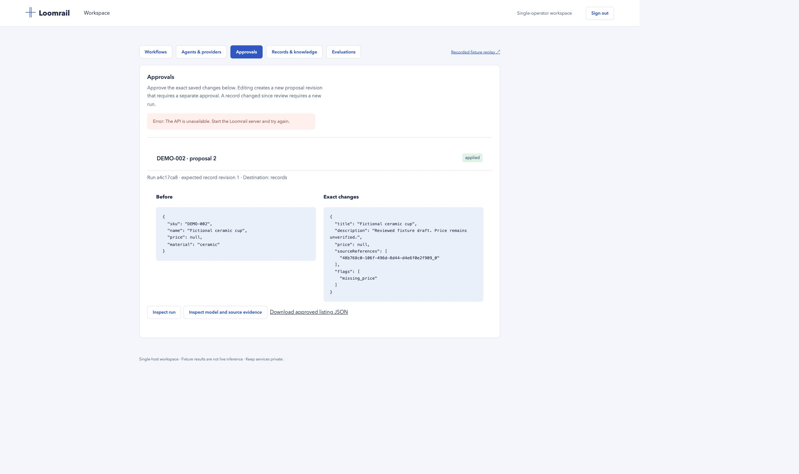

# Recorded catalogue walkthrough

This is a sanitized deterministic fixture demonstration. It does not claim live model inference or real-model semantic quality.

Run `npm run demo:record` to regenerate `apps/web/public/replay.json` from a temporary database with fictional records and guidelines. The recorder never opens the operator workspace or environment model providers. Build/start the application, then open `/replay.html`. Select a scenario and move through the saved checkpoints.

## Recorded scenarios

1. **Approve after reopening database:** a fictional tote is drafted with a pinned source citation. The run pauses at review. The database is closed and reopened; the exact proposal remains. Approval applies one record revision and saves a JSON artifact.
2. **Reject missing-price draft:** a fictional cup retains a null price and a missing_price flag. Rejection stops the run; the record remains unchanged.
3. **Malformed model response:** the fixture deliberately violates the output contract. The agent step fails with INVALID_OUTPUT and no write occurs.

`recording-summary.json` records the capture time and outcomes. The replay exposes saved model/tool evidence and ordered events. It is an interactive trace, not a live workflow or a video.

4. **Provider unavailable:** a deliberate provider failure stops before review or record writes.
5. **Unauthorized tool request:** the server rejects a fixture request for an unassigned tool.
6. **Conflicting guidelines (simulated fixture):** two contradictory fictional sources are retrieved and cited; the dedicated fixture returns an explicit conflict flag, and the operator rejects the proposal. This canned flag does not establish real-model conflict detection.

## Browser acceptance walkthrough

The local test workspace was exercised by importing two fictional CSV rows, saving listing guidelines, creating the catalogue starter, choosing the missing-price record, and starting a run. Its pending approval survived API/worker shutdown and restart. The review screen retained the original record, source chunk ID, and missing-price flag. A replacement proposal incremented its revision to 2 and required a separate approval. It then applied successfully and exposed the approved JSON artifact.

The automated suite additionally covers quota/unavailability/timeout/unauthorized-tool fixtures, worker process death, transactional rollback, stale review decisions, pinned knowledge after source updates, and an actual loopback HTTP service that applies a write then drops the response. Reconciliation confirms the latter without repeating POST.

Publishing this replay to the portfolio is a separate deployment step. No portfolio files or remote services have been modified.
